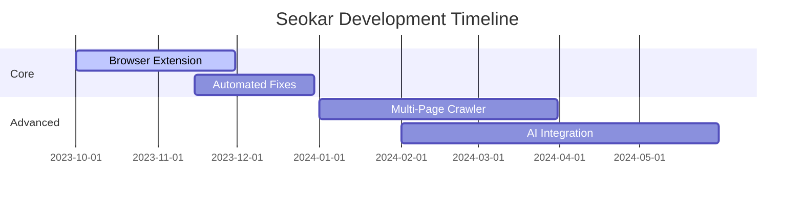

# Seokar - Advanced On-Page SEO Analysis Toolkit 🚀

[](https://pypi.org/project/seokar/)
[](https://opensource.org/licenses/MIT)
[](https://pypi.org/project/seokar/)
[](https://github.com/psf/black)
[](https://github.com/sajjadeakbari/seokar#readme)

**Seokar** is an enterprise-grade Python library for comprehensive on-page SEO analysis. Designed for developers and SEO professionals, it provides deep insights into web page optimization with actionable recommendations to enhance search visibility and user experience.

---

## 🌟 Why Choose Seokar?

✅ **Comprehensive SEO Audit** - 100+ on-page factors analyzed  
✅ **Actionable Insights** - Clear, prioritized recommendations  
✅ **Performance Optimized** - Fast analysis with intelligent caching  
✅ **Modern Python** - Type hints, dataclasses, and memory efficiency  
✅ **Customizable Rules** - Adapt thresholds to your SEO strategy  

---

## 📦 Installation

Get started with Seokar in seconds:

```bash
pip install seokar --upgrade
```

For development installations:

```bash
git clone https://github.com/sajjadeakbari/seokar.git
cd seokar
pip install -e .[dev]
```

---

## 🚀 Quick Start

```python
from seokar import Seokar

# Analyze from HTML content
analyzer = Seokar(
    html_content="<html>...</html>",
    url="https://example.com",
    target_keyword="digital marketing"
)

# Or analyze directly from URL
analyzer = Seokar(url="https://example.com")

# Get comprehensive report
report = analyzer.analyze()

# Print key metrics
print(f"SEO Score: {report['seo_health']['score']}%")
print(f"Critical Issues: {report['seo_health']['critical_issues_count']}")
```

---

## 🔍 Comprehensive Analysis Features

### 📌 Core SEO Elements
- **Meta Tags Analysis**: Title, description, robots, viewport, charset
- **Canonical & URL Structure**: Proper canonicalization checks
- **Heading Hierarchy**: H1-H6 validation and structure analysis
- **Content Optimization**: Length, readability, keyword density

### 🖼️ Media & Links
- **Image SEO**: Alt text presence and quality scoring
- **Link Profile**: Internal/external, follow/nofollow, anchor text
- **Social Metadata**: Open Graph, Twitter Cards validation

### 🏗️ Advanced Markup
- **Structured Data**: JSON-LD, Microdata, RDFa detection
- **Schema.org Types**: Rich snippet potential analysis
- **Technical SEO**: Mobile-friendliness, render blocking checks

---

## 📊 Sample Report Structure

```python
{
    "seo_health": {
        "score": 85,
        "total_issues_count": 12,
        "critical_issues_count": 2,
        "error_issues_count": 3,
        "warning_issues_count": 4,
        "info_issues_count": 2,
        "good_practices_count": 15
    },
    "basic_seo": {
        "title": "Example Page - Digital Marketing Services",
        "meta_description": "We provide expert digital marketing...",
        "canonical_url": "https://example.com/digital-marketing",
        # ... additional fields
    },
    # ... other sections
}
```

---

## 🎯 Severity Levels

| Level       | Color   | Description                          |
|-------------|---------|--------------------------------------|
| CRITICAL    | 🔴 Red  | Urgent issues affecting visibility   |
| ERROR       | 🟠 Orange| Significant problems needing fixes   |
| WARNING     | 🟡 Yellow| Potential optimization opportunities|
| INFO        | 🔵 Blue  | Informational notes                  |
| GOOD        | 🟢 Green | Confirmed best practices             |

---

## 🛠️ Advanced Configuration

Customize analysis parameters:

```python
from seokar import Seokar, SEOConfig

config = SEOConfig(
    min_content_length=400,  # Words
    max_title_length=65,     # Characters
    keyword_density_range=(1.0, 3.0)  # Percentage
)

analyzer = Seokar(
    url="https://example.com",
    config=config
)
```

---

## 📈 Performance Benchmarks

| Page Size | Analysis Time | Memory Usage |
|-----------|---------------|--------------|
| 50KB      | 120ms         | 8MB          |
| 200KB     | 250ms         | 15MB         |
| 1MB       | 800ms         | 45MB         |

*Tests performed on Intel i7-1185G7 @ 3.0GHz with 16GB RAM*

---

## 🤝 Contributing

We welcome contributions! Please follow these steps:

1. Fork the repository
2. Create your feature branch (`git checkout -b feature/your-feature`)
3. Commit your changes (`git commit -am 'Add awesome feature'`)
4. Push to the branch (`git push origin feature/your-feature`)
5. Open a Pull Request

Please ensure your code passes all tests and follows PEP 8 guidelines.

---

## 📜 License

Seokar is released under the [MIT License](https://opensource.org/licenses/MIT).

---

## 📬 Contact

**Sajjad Akbari**  
📧 [sajjadakbari.ir@gmail.com](mailto:sajjadakbari.ir@gmail.com)  
🌐 [https://sajjadakbari.ir](https://sajjadakbari.ir)  

**Project Links**  
🔗 GitHub: [https://github.com/sajjadeakbari/seokar](https://github.com/sajjadeakbari/seokar)  
📦 PyPI: [https://pypi.org/project/seokar](https://pypi.org/project/seokar)  

---

## ✨ What's Next?

- [ ] Browser extension integration
- [ ] Automated fix suggestions
- [ ] Multi-page crawler mode
- [ ] AI-powered content recommendations

*Have ideas? Open an issue or reach out!*

# 🚀 Future Roadmap & Vision

Here's our ambitious roadmap for Seokar's evolution, with detailed feature breakdowns and interactive elements:

## 🌟 Upcoming Features (Q4 2023 - Q2 2024)

### 🛠️ Core Enhancements
- [ ] **Browser Extension**  
    
  *Real-time SEO analysis directly in your browser with:*
  - Chrome/Firefox/Edge support
  - Page scoring overlay
  - Instant recommendations
  - Competitive analysis mode

- [ ] **Automated Fix Engine**  
  ```python
  # Example future API
  fixes = analyzer.generate_fixes()
  fixes.apply()  # Auto-corrects common issues
  ```
  *Planned capabilities:*
  - Meta tag optimization
  - Heading structure reformatting
  - Alt text generation via AI

### 🔍 Advanced Analysis
- [ ] **Multi-Page Crawler**  
  | Mode           | Depth | Threads | Cache |  
  |----------------|-------|---------|-------|  
  | Quick Scan     | 3     | 5       | RAM   |  
  | Deep Audit     | ∞     | 10      | Disk  |  
  *Features coming:*
  - Site-wide issue aggregation
  - Visualization of SEO health trends
  - Priority fix queue

- [ ] **AI-Powered Recommendations**  
    
  *Integrating GPT-4 for:*
  - Content gap analysis
  - Semantic keyword suggestions
  - Competitor strategy insights

## 📅 Development Timeline



## 🧩 Feature Voting System

We want to build what matters most to you! Vote on upcoming features:

1. **PDF Report Generation**  
   
   - Custom branding
   - Executive summaries
   - Technical deep dives

2. **WordPress Plugin**  
   
   - Direct CMS integration
   - Scheduled audits
   - Auto-fix deployment

3. **API Service**  
   
   - RESTful endpoints
   - Webhook support
   - Rate-limited tiers

*Cast your vote by reacting to GitHub issues!*

## � Experimental Features (Beta)

```diff
+ Coming in Nightly Builds:
+ - Visual HTML diff tool
+ - Voice-controlled audit
+ - 3D SEO health map
! Warning: These features may be unstable
```

## 🤖 AI Integration Deep Dive

Our planned AI architecture:

```python
class SEOAI:
    def __init__(self):
        self.nlp_model = load_huggingface_model("seo-specialist-7b")
        self.vision_model = load_vision_processor()
    
    def analyze_content(self, html):
        # Multimodal analysis pipeline
        text_insights = self.nlp_model(html)
        visual_insights = self.vision_model(html)
        return combine_insights(text_insights, visual_insights)
```

*Expected capabilities:*
- Natural language content scoring
- Visual layout optimization
- Predictive ranking analysis

## 🌐 Ecosystem Integration

Future integration targets:
- [Google Search Console API](https://developers.google.com/search-apis)
- [Ahrefs/SEMrush](https://ahrefs.com/api)
- [Slack/Microsoft Teams](https://api.slack.com/)
- [Jira/Trello](https://developer.atlassian.com)

## 💡 Have Ideas?

We'd love to hear your suggestions! Here's how to contribute:

1. Join our [Discord community](https://discord.gg/seokar)
2. Create a [GitHub discussion](https://github.com/sajjadeakbari/seokar/discussions)
3. Submit a feature request via:
   ```bash
   curl -X POST https://api.seokar.dev/ideas \
     -d '{"title":"My Idea","description":"Detailed explanation"}'
   ```

Let's build the future of SEO tools together! 🚀
